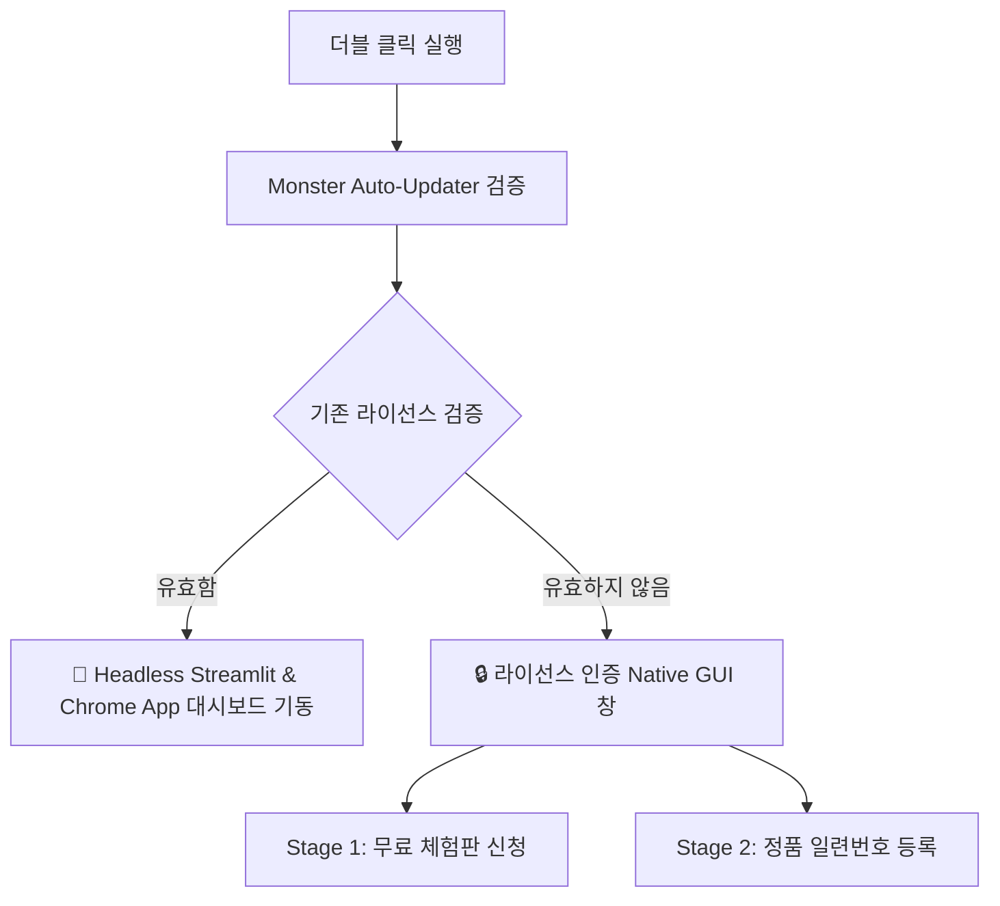

# 제목: N-Place-DB Pro 기능 및 컴포넌트 명세서 (System & UI Component Spec)
- **버전**: v1.1.47
- **일시**: 2026-05-19 13:05

---

## 1. 시스템 개요 (System Overview)
N-Place-DB Pro는 로컬 네이버 플레이스 데이터를 수집하는 **초고속 크롤링 엔진**과 수집 데이터를 기반으로 가동되는 **이메일 및 인스타그램 DM 마케팅 발송 엔진**이 결합된 올인원 비즈니스 마케팅 플랫폼이다. 
사용자가 배포 배치 파일(`NPlace-DB-실행.bat`) 또는 런처 실행 파일(`NPlace-DB-v1.1.47.exe`)을 가동하면, 메인 웹 대시보드가 로드되기 전 **보안 라이선스 인증 및 업데이터 모듈**이 데스크톱 네이티브 GUI 창으로 선행 작동한다.

---

## 2. 프로그램 기동 및 라이선스 인증 GUI 명세 (Native GUI Launcher)

프로그램 실행 즉시 대시보드 기동 전에 노출되는 CustomTkinter 기반의 네이티브 데스크톱 보안 인증 창의 컴포넌트 명세이다.

### 🔒 인증 윈도우 스펙 (`AuthWindow`)
- **타이틀**: `[마케팅몬스터] NPlace-DB 시작하기` (브랜드명 동적 적용)
- **크기**: `480 x 560 px` (창 크기 고정, 조절 불가 `resizable=False`)
- **테마**: Premium Dark Mode (`appearance="dark"`, 배경색 `#0A0D1A`, 메인 카드 `#151934`)
- **디자인 톤**: 모서리 곡률 `24px` 및 보라색 네온 브랜딩 포인트 적용.

### 🧭 스테이지별 컴포넌트 구성

#### Stage 1: 환영 및 무료 체험판 신청 화면 (`self.welcome_stage`)
신규 사용자를 위한 무료 체험 신청 뷰 포트이다.
1. **브랜드 헤더 이미지 & 로고 (`ctk.CTkLabel`)**
   - 로고 파일(`MarketingMonster_logo.png`)을 가로세로 `80x80` 크기로 선명하게 출력.
2. **환영 텍스트 (`ctk.CTkLabel`)**
   - `"환영합니다!"` (Arial 22 bold, 흰색) 및 체험판 사양 안내 문구 배치.
3. **무료 체험 가동 버튼 (`ctk.CTkButton`)**
   - **라벨**: `1회 한정 50건 체험하기` (Arial 18 bold)
   - **크기**: 높이 `70px`, 라운드 `20px`, 색상 보라색 (`#A855F7`)
   - **동작**: 클릭 시 Supabase 클라우드 서버와 통신하여 사용자 PC의 하드웨어 고유 ID(HWID) 기반으로 평생 단 1회 제공되는 50건 수집 체험 라이센스를 즉시 발급 및 활성화.
4. **정품 전환 등록 링크 버튼 (`ctk.CTkButton`)**
   - **라벨**: `이미 정품 키가 있습니다 (등록)` (Arial 12 밑줄형 링크)
   - **동작**: 클릭 시 Stage 2(정품 인증) 화면으로 자연스럽게 전환.

#### Stage 2: 정품 시리얼 키 등록 화면 (`self.auth_stage`)
정품 일련번호를 입력받아 Supabase 클라우드와 바인딩하는 활성화 뷰 포트이다.
1. **일련번호 입력창 (`ctk.CTkEntry`)**
   - **플레이스홀더**: `CM-XXXX-XXXX-XXXX`
   - **크기**: 높이 `58px`, 라운드 `16px`
   - **동작**: 폰트 크기 `18 bold`를 중앙 정렬로 노출하여 사용자의 오타를 사전에 인지하기 쉬운 정교한 입력 형태 제공.
2. **활성화 제출 버튼 (`ctk.CTkButton`)**
   - **라벨**: `인증 및 활성화` (Arial 16 bold)
   - **크기**: 높이 `55px`, 라운드 `16px`
   - **동작**: 입력된 키를 Supabase Database와 조회하여 만료 여부 및 HWID 바인딩 가능 여부를 검증하고, 정상 활성화 시 기기에 라이선스를 즉각 바인딩 완료 후 1초 뒤 창을 닫음.
3. **이전 화면 복귀 버튼 (`ctk.CTkButton`)**
   - **라벨**: `이전으로`
   - **동작**: 클릭 시 Stage 1(체험판 신청) 화면으로 안전하게 복귀.
4. **실시간 통신 상태 라벨 (`self.status_label`)**
   - **동작**: `⏳ 서버 확인 중...`, `✅ 인증 성공!`, `오류: 만료된 인증키입니다` 등의 실시간 인증 엔진 트랜잭션 피드백을 색상 변화와 함께 출력.

---

## 3. 대시보드 탭별 UI 컴포넌트 상세 명세

인증 단계가 완료되면, 프로그램 배후에서 `main_launcher.py`가 Headless Streamlit 웹서버를 부팅하고, 크롬/엣지 브라우저의 **App Mode인 `--app=http://127.0.0.1:port` 인수를 가동**하여 주소창과 툴바가 제거된 Native App 형태의 윈도우 뷰 포트로 메인 대시보드를 매끄럽게 띄운다. 

### 🏠 탭 1: 수집/제어 (Shop Search Tab)
플레이스 크롤링 엔진을 설정하고 가동하여 데이터베이스를 실시간 적재하는 메인 제어 센터이다.

#### 📥 입력 및 제어 컴포넌트
1. **지역 다중 선택 필드 (`st.multiselect`)**
   - **라벨**: `수집할 지역 선택`
   - **동작**: 대한민국 모든 시/도 및 시/군/구 상세 행정구역에 대해 동적 검색 및 다중 선택 제공.
2. **수집 키워드 입력창 (`st.text_input`)**
   - **라벨**: `수집 키워드 입력`
   - **동작**: 플레이스 검색의 주 타겟 키워드 설정 (예: `미용실`, `필라테스`).
3. **최대 수집 건수 설정 (`st.number_input`)**
   - **라벨**: `최대 수집 건수` (기본값: `1200`)
   - **동작**: 수집할 업체의 타겟 상한 건수 정의.
4. **이메일/인스타 필터 선택 박스 (`st.selectbox`)**
   - **라벨**: `이메일/인스타 유무 필터`
   - **선택지**: `전체 업체`, `이메일 있는 업체만`, `인스타 있는 업체만`
   - **동작**: 수집 중 해당 필터 조건에 미달하는 업체는 데이터베이스에 적재하지 않고 즉각 무시(Smart Bypass).
5. **상호명 필터 키워드 (`st.text_input`)**
   - **라벨**: `상호명 필터 키워드`
   - **동작**: 특정 상호명이 포함된 업체만 정밀 수집하도록 필터링.
6. **제어 버튼 컴포넌트**
   - **`🚀 수집 시작` 버튼**: 백그라운드 크롤링 서브프로세스(`step1_refined_crawler.py`)를 기동.
   - **`🛑 수집 정지` 버튼**: 가동 중인 서브프로세스 PID를 추적하여 하위 프로세스까지 안전하게 강제 종료(Task kill).

#### 📊 시각화 및 모니터링 컴포넌트
1. **수집 현황 메트릭 카드 (`st.metric`)**
   - **수집 현황**: `현재 수집 완료 수 / 초기 예상 대상 수` 표시.
   - **속도 및 시간**: `실시간 경과 시간` 및 `초당 평균 처리 속도(초/건)` 동적 리포트.
2. **실시간 수집 결과 데이터 테이블 (`st.dataframe`)**
   - **동작**: 중복이 제거된 데이터베이스 내 최신 600개 업체 목록을 동적으로 표기.
3. **엑셀 다운로드 버튼 (`st.download_button`)**
   - **라벨**: `📥 엑셀(CSV) 저장`
   - **동작**: 테이블 데이터를 `utf-8-sig` 인코딩의 엑셀 호환 CSV 파일로 로컬 다운로드.
4. **실시간 모니터링 로그창 (`st.code`)**
   - **동작**: CSS 클래스 `.log-container`를 사용하여 고정 높이와 고착 스크롤바를 통해 수집 엔진의 로우(Raw) 로그를 실시간 흐름으로 출력.

---

### 📧 탭 2: 이메일 마케팅 발송 (Track A Tab)
수집된 업체 중 이메일 정보가 있는 대상을 필터링하여 맞춤형 메일을 대량 발송하는 모듈이다.

#### 📥 입력 및 제어 컴포넌트
1. **발신 계정 관리 프로필 필드**
   - **활성 이메일 선택 (`st.selectbox`)**: 현재 발송에 사용할 이메일 계정 선택.
   - **아이디/비밀번호 입력창 (`st.text_input`)**: 네이버/Gmail 등의 ID 및 16자리 앱 비밀번호 입력 (입력값은 로컬 저장 시 자동 XOR 암호화).
   - **SMTP 서버 및 포트 (`st.text_input`)**: SMTP 호스트 정보 및 포트 정보 설정.
   - **`➕ 계정 추가` / `❌ 계정 삭제` 버튼**: 다중 발신 프로필 관리 기능.
   - **`⚡ 연결 테스트` 버튼**: 발송 전 SMTP 로그인 및 서버 핸드셰이킹 검증 후 즉각 UI 피드백 출력.
2. **발신자 이름 히스토리 설정 (`st.selectbox` / `st.text_input`)**
   - **동작**: 직접 임의의 발신자 이름을 입력할 수 있으며, 이전에 한 번이라도 사용된 이름은 데이터베이스에 누적 보존되어 목록 드롭다운에서 클릭만으로 선택 가능.
3. **메일 템플릿 본문 컴포넌트**
   - **메일 제목 입력창 (`st.text_input`)**: 메일의 헤더 제목 정의.
   - **메일 본문 영역 (`st.text_area`)**: `{상호명}` 예약 태그를 포함한 본문 입력. 발송 시 업체의 실제 상호로 치환 적용.
4. **테스트 가상 발송 입력창 (`st.text_input`)**
   - **라벨**: `테스트 수신자 1`, `테스트 수신자 2`, `테스트 수신자 3`
   - **`🧪 테스트 발송 실행` 버튼**: 본 발송 전 지정한 3개 주소로 가상 템플릿 메일을 즉각 발송하여 수신 확인 지원.
5. **본 발송 제어 컴포넌트**
   - **발송 대상 테이블 및 선택 토글**: 개별 체크박스 또는 전체 선택을 통해 발송 대상을 지정.
   - **`📧 본 발송 시작` 버튼**: 대량 메일 발송 쓰레드를 기동하고 실시간 진행률 바(Progress Bar) 표시.
   - **`🛑 발송 중지` 버튼**: 대량 발송 루프를 즉각 중단하고 세션을 보존.

---

### 📸 탭 3: 인스타 마케팅 발송 (Track C Tab)
수집된 업체 중 인스타 핸들 정보가 있는 대상에게 Playwright를 가동시켜 다이렉트 메시지(DM)를 자동 전송한다.

#### 📥 입력 및 제어 컴포넌트
1. **발신용 인스타 계정 프로필 필드**
   - **계정 아이디 (`st.selectbox` / `st.text_input`)**: 발신에 활용할 인스타그램 계정.
   - **비밀번호 입력창 (`st.text_input` type="password")**: XOR 암호화 적용 대상.
   - **`➕ 계정 추가` / `❌ 계정 삭제` 버튼**: 멀티 계정 스위칭 프로필 지원.
2. **인스타 DM 템플릿 영역 (`st.text_area`)**
   - **동작**: `{상호명}` 동적 치환 태그를 완벽히 지원하는 DM 텍스트 작성.
3. **테스트 가상 DM 발송창 (`st.text_input`)**
   - **라벨**: `테스트 인스타 ID 1`, `테스트 인스타 ID 2`, `테스트 인스타 ID 3`
   - **`🧪 DM 테스트 발송` 버튼**: 테스트 발송용 Playwright 세션을 가동하여 3개 인스타 ID로 선행 발송 수행.
4. **본 발송 제어 컴포넌트**
   - **`📸 DM 발송 시작` 버튼**: 대량 DM 자동화 프로세스를 기동.
   - **`🛑 발송 중지` 버튼**: 가동 중인 플레이라이트 브라우저 인스턴스를 즉각 강제 종료하고 스크립트 실행 중단.
5. **실시간 모니터링 로그창 (`st.code`)**
   - **동작**: Playwright가 제어하는 크롬 브라우저의 전송 로그(`로그인 시도`, `쿠키 세션 검증`, `타겟 프로필 조회`, `전송 결과`, `404 미존재 계정 바이패스`)를 실시간 출력.

---

### 📖 탭 4: 가이드 (Guide Tab)
마케팅 성공 확률을 극대화하기 위해 내장된 공식 텍스트 안내 정보 가이드북 컴포넌트이다.

#### 📝 탑재 노하우 명세
1. **인스타 계정 신뢰도(Trust Score) 향상 가이드**: 평소 정상 활동 이력이 많고 실사용 중인 계정의 마케팅 효과와 스팸 필터 우회 꿀팁 탑재.
2. **수집 데이터 {상호명} 동적 치환 활용 가이드**: 1:1 맞춤형 마케팅 메시지 구성 예시.
3. **네이버 톡톡 마케팅 및 밴드 우회 활용 가이드**: 다양한 대체 마케팅 채널 활용법 제시.

---

## 4. 백그라운드 프로세스 간 데이터 통신 스키마

대시보드 UI 컴포넌트와 백그라운드 수집 엔진(`step1_refined_crawler.py`)은 로컬 파일 및 데이터베이스를 통해 완전 비동기식으로 실시간 통신한다.

1. **상태 공유 파일 (`crawler_checkpoint.json`)**:
   - `total_shops`: 초기 탐색된 총 예상 대상 업체 수.
   - `current_count`: 현재까지 수집 완료된 업체 수.
   - `elapsed_time`: 경과 시간 (초 단위).
2. **진행 로그 파일 (`engine.log` / `messenger.log`)**:
   - 두 엔진의 `stderr/stdout` 스트림을 리다이렉션하여 실시간 로그박스 컴포넌트에 즉각 출력한다.
3. **로컬 데이터베이스 (`database.sqlite`)**:
   - 수집된 모든 최종 정제 정보는 `database.sqlite` 내의 `shops` 테이블에 적재되며, 대시보드 데이터프레임 컴포넌트가 이를 감시하여 주기적으로 리프레시한다.
