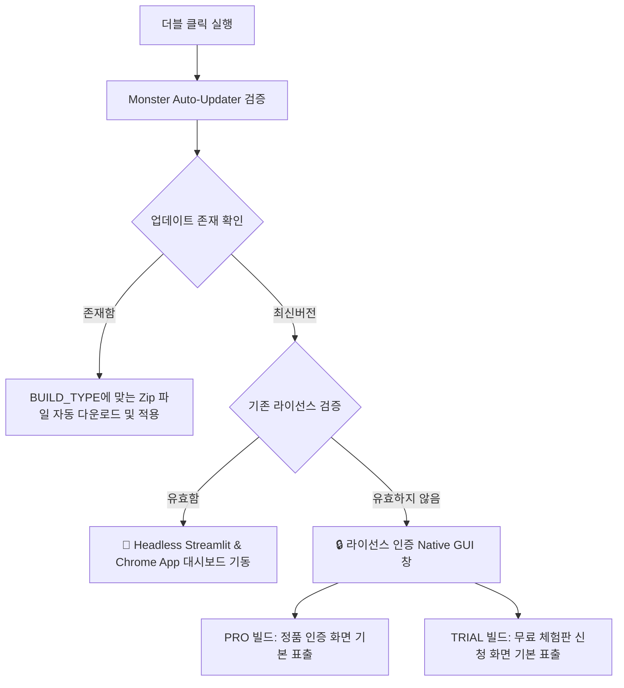

# 제목: N-Place-DB Pro/Trial 기능 및 컴포넌트 명세서 (System & UI Component Spec)
- **버전**: v1.1.61
- **일시**: 2026-06-23

---

## 1. 시스템 개요 (System Overview)
N-Place-DB는 로컬 네이버 플레이스 데이터를 수집하는 **초고속 크롤링 엔진**과 수집 데이터를 기반으로 가동되는 **이메일 및 인스타그램 DM 마케팅 발송 엔진**이 결합된 올인원 비즈니스 마케팅 플랫폼이다. 
빌드 단계부터 **이원화 빌드 시스템(PRO / TRIAL)**을 채택하여, 실행 파일 단위에서 정품과 무료 체험판의 라이선스 검증 로직 및 UI가 분기된다.
사용자가 프로그램을 가동하면 메인 대시보드가 로드되기 전 **보안 라이선스 인증 및 자동 업데이터 모듈**이 데스크톱 네이티브 GUI 창으로 선행 작동한다.

---

## 2. 프로그램 기동 및 라이선스 인증 GUI 명세 (Native GUI Launcher)

프로그램 실행 즉시 대시보드 기동 전에 노출되는 CustomTkinter 기반의 네이티브 데스크톱 보안 인증 창 컴포넌트 명세이다.

### 🔒 인증 윈도우 스펙 (`AuthWindow`)
- **타이틀**: `[마케팅몬스터] NPlace-DB 시작하기` (브랜드명 동적 적용)
- **크기**: `480 x 560 px` (창 크기 고정, 조절 불가 `resizable=False`)
- **테마**: Premium Dark Mode (`appearance="dark"`, 배경색 `#0A0D1A`, 메인 카드 `#151934`)
- **디자인 톤**: 모서리 곡률 `24px` 및 보라색 네온 브랜딩 포인트 적용.

### 🧭 빌드 타입(BUILD_TYPE)별 스테이지 렌더링 분기
`config.BUILD_TYPE`에 따라 앱은 다음과 같이 렌더링을 분기한다.

#### 1) PRO 빌드 (`BUILD_TYPE = 'PRO'`)
유료 구매자(크몽 결제 등)에게 전달되는 정품 클라이언트.
- **기본 노출 화면**: Stage 2 (정품 일련번호 등록 화면)가 최우선으로 렌더링됨.
- **체험판 안내 은닉**: 대문짝만한 체험판 안내 버튼은 제거되었으며, 하단에 `정품 키가 없으신가요? (1회 한정 체험하기)`라는 미세한 텍스트 링크로만 존재하여 유료 구매자의 불쾌감을 원천 차단.

#### 2) TRIAL 빌드 (`BUILD_TYPE = 'TRIAL'`)
잠재 고객 배포용 무료 체험판 클라이언트.
- **기본 노출 화면**: Stage 1 (환영 및 무료 체험판 신청 화면)이 최우선으로 렌더링됨.
- **무료 체험 정책**: `기한 제한 없음 (무기한) / 50건 수집 제한`으로 고정.

---

### 🛡️ 스테이지별 세부 스펙

#### Stage 1: 환영 및 무료 체험판 신청 화면 (`self.welcome_stage`)
1. **브랜드 헤더 이미지 & 로고 (`ctk.CTkLabel`)**
   - 로고 파일(`MarketingMonster_logo.png`) 출력.
2. **환영 텍스트 (`ctk.CTkLabel`)**
   - `"N-Place-DB의 강력한 기능을 무료로 체험해보세요."` 등 안내 문구 배치.
3. **무료 체험 가동 버튼 (`ctk.CTkButton`)**
   - **라벨**: `[무료] 50건 체험하기 (기한 무제한)`
   - **동작**: 클릭 시 Supabase 클라우드와 통신하여 하드웨어 고유 ID(HWID) 기반으로 평생 단 1회 제공되는 50건 수집 체험 라이센스를 발급 및 활성화.
4. **정품 전환 등록 링크 버튼 (`ctk.CTkButton`)**
   - **라벨**: `이미 정품 키가 있습니다 (라이선스 등록)`
   - **동작**: 클릭 시 Stage 2(정품 인증) 화면으로 자연스럽게 전환.

#### Stage 2: 정품(및 디럭스) 시리얼 키 등록 화면 (`self.auth_stage`)
1. **일련번호 입력창 (`ctk.CTkEntry`)**
   - **플레이스홀더**: `CM-XXXX / DLX-XXXX / TEST-XXXX`
   - **동작**: 입력된 키를 Supabase Database와 조회하여 만료 여부 및 HWID 바인딩 가능 여부를 검증하고, 정상 활성화 시 기기에 라이선스를 즉각 바인딩 완료 후 1초 뒤 창을 닫음.
2. **실시간 통신 상태 라벨 (`self.status_label`)**
   - `⏳ 서버 확인 중...`, `✅ 인증 성공!`, `오류: 만료된 인증키입니다` 등의 트랜잭션 피드백 색상 변화 출력.

---

## 3. 이원화 자동 배포 및 업데이트 시스템 스키마

### 🔄 Build & Deploy Pipeline (`build_exe.py` & `deploy_ota.py`)
1. **Sequential Build**: `build_exe.py`가 가동되면 `config.py`의 `BUILD_TYPE` 상수를 런타임에 동적으로 변경하여 `NPlace-DB-PRO`와 `NPlace-DB-TRIAL` 환경으로 각각 PyInstaller 빌드를 순차 진행한다.
2. **Static Zip Naming**: 배포 스크립트(`deploy_ota.py`)는 각 빌드 결과를 `NPlace-DB-Pro.zip`과 `NPlace-DB-Trial.zip` 이라는 **버전 번호가 제외된 고정된 파일명**으로 압축하여 GitHub Releases 에 업로드한다.
3. **Dashboard Integration**: 3Monster 웹 대시보드(어드민)에서는 위 고정된 파일명 링크(`https://github.com/.../releases/latest/download/NPlace-DB-Pro.zip`)를 직접 참조하여, 관리자가 다운로드 버튼을 누를 때마다 수동 업데이트 없이도 항상 가장 최신 버전의 Pro/Trial 파일을 유저에게 전달할 수 있도록 구성되어 있다.

### ♻️ OTA Auto-Updater (`updater.py`)
- 앱 기동 시 `updater.py`는 Supabase의 `app_versions` 테이블을 폴링하여 다운로드 링크를 획득한다.
- 획득한 URL이 `Pro.zip`을 가리키고 있으나 현재 실행 중인 클라이언트가 `TRIAL` 빌드라면, `updater.py`는 다운로드 URL 내부의 `Pro.zip` 문자열을 `Trial.zip`으로 런타임 치환(`download_url.replace("Pro.zip", "Trial.zip")`)하여 자신에게 맞는 버전을 정확하게 다운로드 및 적용한다.

---

## 4. 대시보드 탭별 UI 컴포넌트 상세 명세

인증 단계가 완료되면, 프로그램 배후에서 `main_launcher.py`가 Headless Streamlit 웹서버를 부팅하고, 크롬/엣지 브라우저의 **App Mode(`--app=http://127.0.0.1:port`) 인수를 가동**하여 메인 대시보드를 매끄럽게 띄운다.

### 🏠 탭 1: 수집/제어 (Shop Search Tab)
플레이스 크롤링 엔진을 설정하고 가동하여 데이터베이스를 실시간 적재하는 메인 제어 센터이다.
- **수집 파라미터**: 지역 다중 선택, 수집 키워드, 최대 수집 건수, 이메일/인스타 필터(Smart Bypass), 상호명 필터.
- **실시간 모니터링**: 수집 현황 메트릭, 최신 600개 데이터 테이블, `.log-container`를 통한 `stdout/stderr` 로그 스트리밍.

### 📧 탭 2: 이메일 마케팅 발송 (Track A Tab)
- **SMTP 프로필**: 다중 이메일 발신 계정 등록/삭제/연결 테스트 (XOR 암호화 로컬 보존).
- **개인화 치환**: `{상호명}` 태그를 통한 맞춤형 템플릿 메일링.

### 📸 탭 3: 인스타 마케팅 발송 (Track C Tab)
- **Playwright 엔진**: 수집된 인스타 핸들 대상 브라우저 자동화 다이렉트 메시지 전송.
- **치환 및 우회**: `{상호명}` 치환, 비존재 계정 스킵 등 안정화 알고리즘 탑재.

### 📖 탭 4: 가이드 (Guide Tab)
- 기존 단일 가이드 페이지를 3개의 탭(수집 가이드, 이메일 가이드, 인스타 가이드)으로 분리하여 가독성 강화.

---

## 5. 백그라운드 프로세스 간 데이터 통신 스키마

대시보드 UI 컴포넌트와 백그라운드 수집 엔진(`step1_refined_crawler.py`)은 로컬 파일 및 데이터베이스를 통해 완전 비동기식으로 실시간 통신한다.
1. **상태 공유 파일 (`crawler_checkpoint.json`)**: 탐색된 총 대상 업체 수, 현재까지 완료된 업체 수, 경과 시간 공유.
2. **진행 로그 파일 (`engine.log` / `messenger.log`)**: 엔진의 로우 스트림을 로그박스 컴포넌트에 즉각 출력.
3. **로컬 데이터베이스 (`database.sqlite`)**: 최종 수집 및 정제 정보 적재. 대시보드가 감시 후 실시간 UI 반영.
